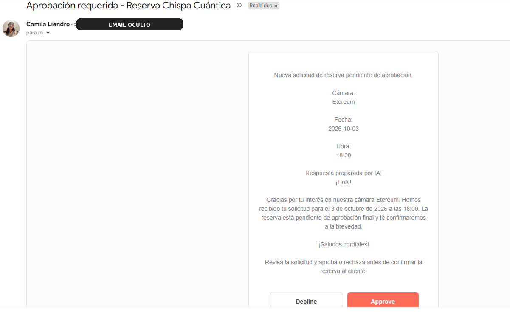
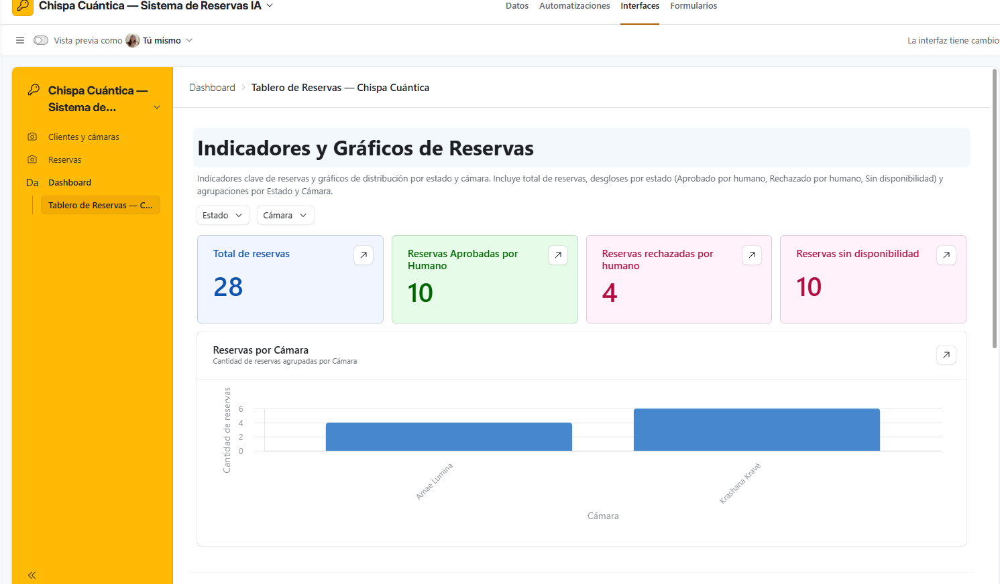

# Chispa Cuántica — Sistema de Reservas IA

> Proyecto final — Ecosistema de Automatización IA Autónomo para Negocios

Sistema de reservas construido con **n8n + Gmail + OpenAI + Airtable**, diseñado para interpretar solicitudes escritas en lenguaje natural, consultar disponibilidad, registrar el proceso y mantener una aprobación humana antes de confirmar una reserva.


## ¿Qué problema resuelve?

Una persona puede pedir un turno por correo de muchas formas distintas. No siempre escribe un asunto específico ni sigue una plantilla. Este flujo toma ese mensaje libre, lo transforma en datos estructurados y decide qué ruta seguir sin depender de una entrada rígida.

El objetivo fue separar claramente dos responsabilidades:

- **La IA interpreta el mensaje.**
- **Las reglas del sistema deciden qué se puede hacer.**

La disponibilidad no se inventa con IA y una reserva no se confirma automáticamente: antes de contactar al cliente, el proceso pasa por un punto **Human-in-the-loop**.

## Stack

| Capa | Herramienta | Uso |
|---|---|---|
| Orquestación | n8n | Trigger, validaciones, routing, integraciones y Error Handling |
| Entrada / salida | Gmail | Recepción y respuestas en el mismo hilo |
| IA | OpenAI | Clasificación de intención y extracción de datos |
| Base de datos | Airtable | Clientes, cámaras, disponibilidad, reservas y logs |
| HITL | Gmail / n8n | Aprobación o rechazo antes de confirmar |
| Observabilidad | Airtable Interface | KPIs y monitoreo del flujo |

## Flujo principal

```text
Gmail Trigger
    ↓
OpenAI — clasificación + extracción
    ↓
Normalización de campos
    ↓
Switch por intención
    ├── Consulta general → Reply en Gmail
    ├── Irrelevante → Fin
    └── Reserva
          ↓
       Validación
          ↓
       Buscar / crear cliente
          ↓
       Consultar disponibilidad
          ├── No disponible → buscar alternativas → responder
          └── Disponible → crear reserva pendiente
                               ↓
                         Human-in-the-loop
                         ├── Approve → confirmar + log
                         └── Decline → rechazar + log
```

## Intenciones contempladas

- `crear_reserva`
- `consulta_general`
- `cancelar_reserva`
- `modificar_reserva`
- `irrelevante`

Las rutas de cancelación y modificación quedaron previstas para una siguiente iteración. La entrega se concentra en reservas, consultas, validación de datos, disponibilidad, HITL y resiliencia.

## Modelo de datos

Airtable se usa como memoria persistente y relacional del sistema.

- **Clientes** → identidad y vínculo con reservas.
- **Cámaras** → catálogo de servicios.
- **Disponibilidad** → slots válidos por cámara, fecha y hora.
- **Reservas** → estado completo del proceso.
- **Logs** → trazabilidad de éxitos y errores.

La documentación detallada está en [`docs/02_Manual_Operativo_Datos_Chispa_Cuantica.pdf`](docs/02_Manual_Operativo_Datos_Chispa_Cuantica.pdf).

## Human-in-the-loop

Cuando hay disponibilidad, el flujo no confirma directamente. Primero crea una reserva pendiente y envía una solicitud de aprobación con **Approve / Decline**.

Esto evita que una salida probabilística ejecute por sí sola una acción crítica.



## Resiliencia

El flujo contempla:

- `Retry On Fail` en nodos críticos.
- rutas de `Error Output`;
- logs de error en Airtable;
- códigos de error identificables;
- validación determinista de cámara, fecha y hora;
- respuesta en el mismo `Thread ID` de Gmail;
- finalización silenciosa para mensajes irrelevantes;
- filtro anti-loop a verificar en Gmail Trigger antes de la entrega.

Durante las pruebas se forzó un error de OpenAI y quedó registrado como `OPENAI_API_ERROR`.


## Pruebas realizadas

Se probaron más de cinco escenarios:

1. reserva disponible + aprobación humana;
2. reserva disponible + rechazo humano;
3. slot sin disponibilidad;
4. solicitud con datos faltantes;
5. consulta general;
6. mensaje irrelevante;
7. fallo forzado de OpenAI.

La matriz completa está en [`tests/test-stress.md`](tests/test-stress.md).

## Dashboard

El tablero de Airtable permite revisar el sistema sin entrar a n8n.

Para la entrega final deben quedar visibles como mínimo:

- **Tasa de aprobación**;
- **Volumen de salida**;
- **Tasa de error**.

También se muestran métricas complementarias como total de reservas, aprobadas, rechazadas, sin disponibilidad y Success/Error.



> El enlace público de la Shared View debe agregarse en [`submission/LINKS_PUBLICOS.md`](submission/LINKS_PUBLICOS.md) y probarse en incógnito.

## Documentación de la rúbrica

| Criterio | Archivo |
|---|---|
| Arquitectura | [`docs/01_Arquitectura_Sistema_Chispa_Cuantica.pdf`](docs/01_Arquitectura_Sistema_Chispa_Cuantica.pdf) |
| Datos + JSON | [`docs/02_Manual_Operativo_Datos_Chispa_Cuantica.pdf`](docs/02_Manual_Operativo_Datos_Chispa_Cuantica.pdf) |
| Costos | [`docs/03_Matriz_Costos_Chispa_Cuantica.pdf`](docs/03_Matriz_Costos_Chispa_Cuantica.pdf) |
| Seguridad + resiliencia | [`docs/04_Seguridad_Resiliencia_Chispa_Cuantica.pdf`](docs/04_Seguridad_Resiliencia_Chispa_Cuantica.pdf) |
| Dashboard | [`docs/05_Dashboard_Control.md`](docs/05_Dashboard_Control.md) |

La documentación consolidada también está disponible en [`docs/00_Documentacion_Completa_Chispa_Cuantica.pdf`](docs/00_Documentacion_Completa_Chispa_Cuantica.pdf).

## Video demo

El video muestra el trigger, procesamiento en n8n, Airtable, HITL, resultado final, Error Handling y dashboard.

[`video/Video_Demo_Chispa_Cuantica.mp4`](video/Video_Demo_Chispa_Cuantica.mp4)

Las credenciales sensibles y correos de terceros deben permanecer ocultos en toda evidencia pública.

## Estructura del repositorio

```text
chispa-cuantica-automation/
├── README.md
├── .gitignore
├── docs/
│   ├── 00_Documentacion_Completa_Chispa_Cuantica.pdf
│   ├── 01_Arquitectura_Sistema_Chispa_Cuantica.pdf
│   ├── 02_Manual_Operativo_Datos_Chispa_Cuantica.pdf
│   ├── 03_Matriz_Costos_Chispa_Cuantica.pdf
│   ├── 04_Seguridad_Resiliencia_Chispa_Cuantica.pdf
│   └── 05_Dashboard_Control.md
├── workflow/
│   ├── chispa-cuantica-reservas-n8n.json   ← export real pendiente
│   └── EXPORTAR_WORKFLOW_N8N.md
├── screenshots/
│   └── evidencias anonimizadas
├── tests/
│   └── test-stress.md
├── video/
│   └── Video_Demo_Chispa_Cuantica.mp4
└── submission/
    ├── CHECKLIST_ENTREGA.md
    └── LINKS_PUBLICOS.md
```

## Antes de publicar

No subir:

- API Keys;
- tokens OAuth;
- archivos `.env`;
- passwords;
- exports de credenciales;
- cookies;
- capturas con emails personales sin anonimizar.

El archivo JSON de n8n debe ser el **export real del workflow**, no una reconstrucción manual.

## Estado del proyecto

La lógica principal está implementada y probada. Antes de entregar quedan tres verificaciones externas que no pueden resolverse desde este repositorio:

- exportar el JSON final de n8n;
- publicar la Shared View con los tres KPIs obligatorios;
- completar y probar en incógnito los enlaces públicos de Airtable y del documento maestro.

## Autora

**Camila Liendro**  
Proyecto final — AI Automation
